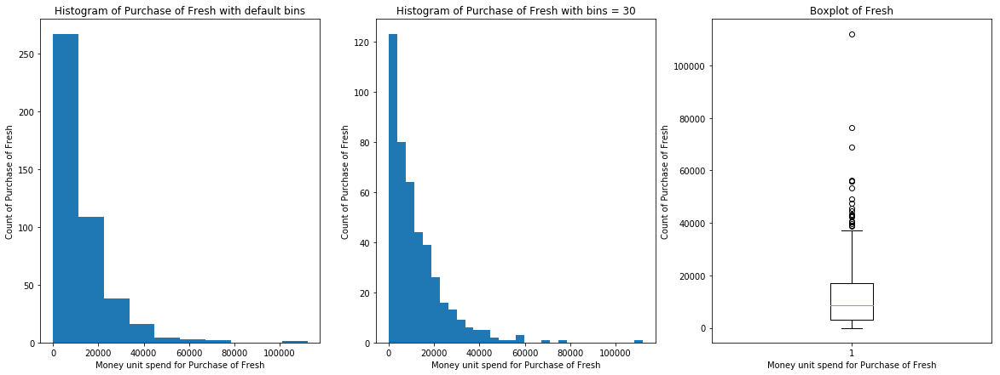

# Project: Creating Customer Segments

# Table of Contents
- [Project Description](#project-description)
- [Environment and Programming language](#environment-and-programming-language)
- [Data Description](#data-description)
- [Exploratory Data Analysis](#exploratory-data-analysis)
  * [Reading the Data](#reading-the-data)
  * [Data Exploration](#Data-exploration)
  * [Selecting Samples](#selecting-samples)
  * [Feature Relevance](#feature-relevance)
- [Visualize Feature Distributions](#visualize-feature-distributions)
- [Data Pre-processing](#data-pre-processing)
  * [Feature Scaling](#feature-scaling)
  * [Outlier Detection](#outlier-detection)
- [Feature Transformation](#feature-transformation)
  * [PCA implementation](#pca-implementation)
  * [Dimensionality Reduction](#dimensionality-reduction)
- [Visualizing a Biplot](#visualizing-a-biplot)
- [Clustering](#clustering)
  * [Creating Clusters](#creating-clusters)
- [Cluster Visualization](#cluster-visualization)
  * [Data Recovery](#data-recovery)
- [Conclusion](#conclusion)
- [Visualizing Underlying Distribution](#visualizing-underlying-distribution)

## Project Description
In this project, I will analyze a dataset containing data on various customer's annual spending amounts (reported in *monetary units*) of diverse product categories for internal structure. One goal of this project is to best describe the variation in the different types of customers that a wholesale distributor interacts with. Doing so would equip the distributor with insight into how to best structure their delivery service to meet the needs of each customer.

## Environment and Programming language
* Python 2.7.14 has been used.
* Miniconda framework has been used which can be downloaded from this [link](https://repo.continuum.io/miniconda/).
* Once installed, open conda prompt.
* Create virtual environment by using `conda env create -f environment.yaml`. [**environment.yaml**](./environment.yaml) has been included in the repository.
* Jupyter notebook has been used for interactively analyzing and exploring the data.
* Python code and calculation given in the [Notebook file](./customer_segments.ipynb) file.
* We are going to use [helper file](./visuals.py). This file contains following 4 functions:
  1. `pca_results(good_data, pca)`: Create a DataFrame of the PCA results includes dimension feature weights and explained variance Visualizes the PCA results.
  2. `cluster_results(reduced_data, preds, centers, pca_samples)`:Visualizes the PCA-reduced cluster data in two dimensions adds cues for cluster centers and student-selected sample data
  3. `biplot(good_data, reduced_data, pca)`: Produce a biplot that shows a scatterplot of the reduced data and the projections of the original features.
  4. `channel_results(reduced_data, outliers, pca_samples)`: Visualizes the PCA-reduced cluster data in two dimensions using the full dataset data is labeled by "Channel" and cues added for student-selected sample data.
* [Data](./customers.csv) is provided as **.csv** file.

## Data Description
The dataset for this project can be found on the [UCI Machine Learning Repository](https://archive.ics.uci.edu/ml/datasets/Wholesale+customers). For the purposes of this project, the features `'Channel'` and `'Region'` will be excluded in the analysis — with focus instead on the six product categories recorded for customers.

## Exploratory Data Analysis
### Reading the Data
**pandas read_csv()** function is used to read the data.

### Data Exploration
In this section, I will begin exploring the data through visualizations to understand how each feature is related to the others. I will observe a statistical description of the dataset, consider the relevance of each feature, and select a few sample data points from the dataset which I will track through the course of this project.

Dataset is composed of six important product categories: **'Fresh'**, **'Milk'**, **'Grocery'**, **'Frozen'**, **'Detergents_Paper'**, and **'Delicatessen'**.

First I used `df.describe()` pandas function to get the mean, median, standard deviation, minimum, maximum, count, first and third quartiles.

From the various statistics, I can see features are **skewed**, there are **outliers** as max values are very high as compared to median.

### Selecting Samples
To get a better understanding of the customers and how their data will transform through the analysis, it would be best to select a few sample data points and explore them in more detail. So I selected 3 customers.

Following are the chosen samples:

|      | Fresh   | Milk   | Grocery  | Frozen | Detergents_Paper | Delicatessen |
| --   | --    | --   | --     | --   | -------------- | ---------- |
| 0 | 14276 | 803 | 3045 | 485 | 100 | 518 |
| 1 | 140 | 8847 | 3823 | 142 | 1062 | 3 |
| 2 | 3047 | 5970 | 4910 | 2198 | 850 | 317 |

Following is the Mean value of the all the features for comparison with chosen samples:

| Fresh   | Milk   | Grocery  | Frozen | Detergents_Paper | Delicatessen |
| --    | --   | --     | --   | -------------- | ---------- |
| 12000.2977 | 5796.2 | 7951.3 | 3071.931818 | 2881.4 | 1524.8 |

Following is the chosen sample analysis:

**First Sample**

This sample has spent lot on "Fresh". So this seems like delis or a small shop from which people buys lot of "fresh" things like vegetables, fresh meat, etc. This sample has bought lot of "delicatessen" but less than the mean but has bought "fresh" more than the mean value.

**Second Sample**

Second sample has bought "Milk" higher than the mean value of the milk. So this seems like a cafe which usage lot of "Milk" for their products. This has higher "Detergent_paper" but this values is less than the mean but that is required because cafe visitors usually like to wash hands after drinking/eating.

**Third Sample**

This sample has moderate values of all the items which somewhat denotes that this can be a small restaurant which requires all the items but in moderate quantities. All of the items are less than mean in this sample.

### Feature Relevance
One interesting thought to consider is if one (or more) of the six product categories is actually relevant for understanding customer purchasing. That is to say, is it possible to determine whether customers purchasing some amount of one category of products will necessarily purchase some proportional amount of another category of products? We can make this determination quite easily by training a supervised regression learner on a subset of the data with one feature removed, and then score how well that model can predict the removed feature.

Following steps were followed:
- Assign `new_data` a copy of the data by removing a feature of your choice using the `DataFrame.drop` function.
- Use `sklearn.cross_validation.train_test_split` to split the dataset into training and testing sets.
  - Use the removed feature as your target label. Set a `test_size` of `0.25` and set a `random_state`.
- Import a decision tree regressor, set a `random_state`, and fit the learner to the training data.
- Report the prediction score of the testing set using the regressor's `score` function.

Following is the result:
1. I attempted to predict "Delicatessen" feature.
2. Reported prediction score is -0.4291251956585451.
3. This feature is necessary for identifying the customer's spending habits because socre is negative which denotes that model fails to fit the data which means that "Delicatessen" can't be predicted by using other features.

## Visualize Feature Distributions
To get a better understanding of the dataset, we can construct a scatter matrix of each of the six product features present in the data. If you found that the feature you attempted to predict above is relevant for identifying a specific customer, then the scatter matrix below may not show any correlation between that feature and the others. Conversely, if you believe that feature is not relevant for identifying a specific customer, the scatter matrix might show a correlation between that feature and another feature in the data.

Following is the scatter matrix for all features:

**Correlation coefficients between all the features were calculated and heatmap was plotted using `heatmap()` function of seaborn library.** Following is the the heatmap.

Further histograms with default bins and with 30 bins and boxplots were plotted. Function `plotting_visualization(variable, xlabel, ylabel, title1, title2, title3, figname)` was used for this. This function takes each feature as input and generate 2 histograms with different bin size and one boxplot of the features. Following are the plots of all the features.

Following are the observation from various plots:

**Normality** : None of the features are normally distributed. This can be seen from the fact that there is big difference between mean and median of all the features and also histogram of all the fearures are not normally distributed. All of the features are right skewed as all of them are having long right tail and also all features have mean greater than median.

**Outliers** : All of the features are having some outliers which are evident from the visualization of boxplots and histograms.

**Data points positions** : From the histograms we can clearly see lot of first bin contains the maximum data points. Specifically features "Detergents_Paper" and "Delicatessen" have most of the points in first bin which is showing that lots of points are near zero.

- Correlation

There is strong correlation exists between "Milk and Grocery", "Milk and Detergent_paper" and "Grocery and Detergent_paper". Rest other either having week correlation or no correlation at all.

- Selected feature relevance

Feature "Delicatessen" have some level of week correlation with with all other features except "Detergent_paper" with which it have almost no correlation. So this feature is relevant.

- Data for most of the features are not normally distributed.

## Data Pre-processing
In this section, I will preprocess the data to create a better representation of customers by performing a scaling on the data and detecting (and optionally removing) outliers. Pre-processing data is often times a critical step in assuring that results you obtain from your analysis are significant and meaningful.

### Feature Scaling
If data is not normally distributed, especially if the mean and median vary significantly (indicating a large skew), it is most [often appropriate](http://econbrowser.com/archives/2014/02/use-of-logarithms-in-economics) to apply a non-linear scaling — particularly for financial data. One way to achieve this scaling is by using a [Box-Cox test](http://scipy.github.io/devdocs/generated/scipy.stats.boxcox.html), which calculates the best power transformation of the data that reduces skewness. A simpler approach which can work in most cases would be applying the natural logarithm.

I performed following steps:
- Assign a copy of the data to `log_data` after applying logarithmic scaling. Use the `np.log` function for this.
- Assign a copy of the sample data to `log_samples` after applying logarithmic scaling. Again, use `np.log`.

Following are the various plots after feature scaling.

**From the new visualization, we can clearly see data is more normal now.**

### Outlier Detection
Detecting outliers in the data is extremely important in the data preprocessing step of any analysis. The presence of outliers can often skew results which take into consideration these data points. There are many "rules of thumb" for what constitutes an outlier in a dataset. Here, we will use [Tukey's Method for identfying outliers](http://datapigtechnologies.com/blog/index.php/highlighting-outliers-in-your-data-with-the-tukey-method/): An *outlier step* is calculated as 1.5 times the interquartile range (IQR). A data point with a feature that is beyond an outlier step outside of the IQR for that feature is considered abnormal.

Following steps were followed.
- Assign the value of the 25th percentile for the given feature to `Q1`. Use `np.percentile` for this.
- Assign the value of the 75th percentile for the given feature to `Q3`. Again, use `np.percentile`.
- Assign the calculation of an outlier step for the given feature to `step`.
- Optionally remove data points from the dataset by adding indices to the `outliers` list.

We have following analysis after outlier detection:
- There are 5 data pints which are outliers in the multiple features.
- These points should be removed from the dataset.
- K-means centroid of a cluster is the mean of the all the data points in that cluster. Mean is always influenced by presence of outlier values in such a way that mean can increase or decrease tremendously because of outlier presence. Here if any outlier is outlier for multiple features then it can impact the K-means and ultimately centroid placement and cause different cluster all together or in worst case outlier can itself become a centroid and can be in its own cluster.

## Feature Transformation
In this section we will use principal component analysis (PCA) to draw conclusions about the underlying structure of the wholesale customer data. Since using PCA on a dataset calculates the dimensions which best maximize variance, we will find which compound combinations of features best describe customers.

### PCA implementation
Now that the data has been scaled to a more normal distribution and has had any necessary outliers removed, we can now apply PCA to the `good_data` to discover which dimensions about the data best maximize the variance of features involved. In addition to finding these dimensions, PCA will also report the *explained variance ratio* of each dimension — how much variance within the data is explained by that dimension alone. Note that a component (dimension) from PCA can be considered a new "feature" of the space, however it is a composition of the original features present in the data.

I followed following steps for PCA implementation.
- Import `sklearn.decomposition.PCA` and assign the results of fitting PCA in six dimensions with `good_data` to `pca`.
- Apply a PCA transformation of `log_samples` using `pca.transform`, and assign the results to `pca_samples`.

Following is the visualization of the explained variance by each PCA dimensions:

A positive increase in a specific dimension corresponds with an increase of the positive-weighted features and a decrease of the negative-weighted features. The rate of increase or decrease is based on the individual feature weights.

- We can see that first and second principal components are having 0.4447 and 0.2638 variance explained. So cumulative variance explained by first 2 principal components are 0.7085
- First 4 principal components are explaining 0.9311 variance.
- Feature weights denotes the correlation between principal component/Dimension and feature. High weight of the feature be it negative or positive denotes that feature has been well explained by that principal component or dimension.

**Dimension 1**: This principal component has more correlation with Milk, Grocery and Detergent_paper. This principal component explained 0.4447 variance of the data. Rest other three features are not that much correlated with first dimension.

**Dimension 2** : This dimension is highly correlated with "Fresh", "Frozen" and "Delicatessen" and very less correlated with  other three. This is expected because Dimension 1 and Dimension 2 should be orthogonal to each other so one will explain more variance of the features which were not explained properly by other dimension.

**Dimension 3** : This dimension is highly correlated with "Fresh", "Frozen" and "Delicatessen".

**Dimension 4** : This dimension is highly correlated with "Milk", "Grocery", "Detergent_paper" and "Delicatessen".

First 4 dimensions explained 0.9311 variance of the data. In all the dimensions low values of weights denotes the less importance of that feature in that dimension and vice versa. Negative values of weights represent negative correlation between dimension and feature and vice versa.

### Dimensionality Reduction
When using principal component analysis, one of the main goals is to reduce the dimensionality of the data — in effect, reducing the complexity of the problem. Dimensionality reduction comes at a cost: Fewer dimensions used implies less of the total variance in the data is being explained. Because of this, the *cumulative explained variance ratio* is extremely important for knowing how many dimensions are necessary for the problem. Additionally, if a significant amount of variance is explained by only two or three dimensions, the reduced data can be visualized afterwards.

Following steps were used for dimensionality reduction:

- Assign the results of fitting PCA in two dimensions with `good_data` to `pca`.
- Apply a PCA transformation of `good_data` using `pca.transform`, and assign the results to `reduced_data`.
- Apply a PCA transformation of `log_samples` using `pca.transform`, and assign the results to `pca_samples`.

## Visualizing a Biplot
A biplot is a scatterplot where each data point is represented by its scores along the principal components. The axes are the principal components (in this case `Dimension 1` and `Dimension 2`). In addition, the biplot shows the projection of the original features along the components. A biplot can help us interpret the reduced dimensions of the data, and discover relationships between the principal components and original features.

Following is the Biplot:

Once we have the original feature projections (in red), it is easier to interpret the relative position of each data point in the scatterplot. For instance, a point the lower right corner of the figure will likely correspond to a customer that spends a lot on `'Milk'`, `'Grocery'` and `'Detergents_Paper'`, but not so much on the other product categories.

First component is highly correlated with "Paper", "Grocery" and "Milk" and second component is highly correlated with "Delicatessen", "Fresh" and "Frozen" which is agreeing with earlier plot showing the weights of each feature.

## Clustering
In this section, we will choose to use either a K-Means clustering algorithm or a Gaussian Mixture Model clustering algorithm to identify the various customer segments hidden in the data. We will then recover specific data points from the clusters to understand their significance by transforming them back into their original dimension and scale.

**Advantages of K-Means Clustering**

1. It is generally fast to implement.
2. Simple and easy to implement.
3. Interpretation is easier.
4. Gives hard clusters. So data points can only belong to one cluster only.

**Advantages of Gaussian Mixture Model**

1. Useful for soft clustering.
2. One of the fastest algorithm for soft clustering.
3. Algorithm maximizes only the likelihood, it will not bias the means towards zero, or bias the cluster sizes to have specific structures that might or might not apply.

**Which algorithm to use**

Given the information and requirements we should use K-Means clustering because we need to have hard clustering because segmentation of customers are required.

### Creating Clusters
Depending on the problem, the number of clusters that you expect to be in the data may already be known. When the number of clusters is not known *a priori*, there is no guarantee that a given number of clusters best segments the data, since it is unclear what structure exists in the data — if any. However, we can quantify the "goodness" of a clustering by calculating each data point's *silhouette coefficient*. The [silhouette coefficient](http://scikit-learn.org/stable/modules/generated/sklearn.metrics.silhouette_score.html) for a data point measures how similar it is to its assigned cluster from -1 (dissimilar) to 1 (similar). Calculating the *mean* silhouette coefficient provides for a simple scoring method of a given clustering.

I followed following steps to create clusters:

- Fit a clustering algorithm to the `reduced_data` and assign it to `clusterer`.
- Predict the cluster for each data point in `reduced_data` using `clusterer.predict` and assign them to `preds`.
- Find the cluster centers using the algorithm's respective attribute and assign them to `centers`.
- Predict the cluster for each sample data point in `pca_samples` and assign them `sample_preds`.
- Import `sklearn.metrics.silhouette_score` and calculate the silhouette score of `reduced_data` against `preds`.
  - Assign the silhouette score to `score` and print the result.

Function `clustering_function(data_set, number_of_clusters)` was used to perform the above mentioned steps. Number of clusters from 2 to 20 were tried and following are the silhouette score for all the clusters values:

* silhouette_score is 0.426877212363 when number of clusters are 2
* silhouette_score is 0.397952878275 when number of clusters are 3
* silhouette_score is 0.331760618074 when number of clusters are 4
* silhouette_score is 0.351621421455 when number of clusters are 5
* silhouette_score is 0.362362120107 when number of clusters are 6
* silhouette_score is 0.362753127477 when number of clusters are 7
* silhouette_score is 0.349777584866 when number of clusters are 8
* silhouette_score is 0.359494185118 when number of clusters are 9
* silhouette_score is 0.345059536367 when number of clusters are 10
* silhouette_score is 0.35289101539 when number of clusters are 11
* silhouette_score is 0.345134881084 when number of clusters are 12
* silhouette_score is 0.363822490147 when number of clusters are 13
* silhouette_score is 0.362793723941 when number of clusters are 14
* silhouette_score is 0.346061742257 when number of clusters are 15
* silhouette_score is 0.350387311248 when number of clusters are 16
* silhouette_score is 0.342579703217 when number of clusters are 17
* silhouette_score is 0.353422721735 when number of clusters are 18
* silhouette_score is 0.34662080372 when number of clusters are 19
* silhouette_score is 0.341145843272 when number of clusters are 20

**Best silhouette_score is when number of clusters are 2**

## Cluster Visualization
Once we've chosen the optimal number of clusters for your clustering algorithm using the scoring metric above, we can now visualize the results by executing the code block below.

Following is the plot of the same:

### Data Recovery
Each cluster present in the visualization above has a central point. These centers (or means) are not specifically data points from the data, but rather the *averages* of all the data points predicted in the respective clusters. For the problem of creating customer segments, a cluster's center point corresponds to *the average customer of that segment*. Since the data is currently reduced in dimension and scaled by a logarithm, we can recover the representative customer spending from these data points by applying the inverse transformations.

Following steps were used for reverse transformation:

- Apply the inverse transform to `centers` using `pca.inverse_transform` and assign the new centers to `log_centers`.
- Apply the inverse function of `np.log` to `log_centers` using `np.exp` and assign the true centers to `true_centers`.

We have following values of original features in the centroid of the each cluster.

|    | Fresh | Milk | Grocery | Frozen | Detergent_Paper | Delicatessen |
| -- | --    | ---- | ------- | ------ | --------------- | ------------ |
| Segment 0 | 4016.0 | 7916.0 | 12126.0 | 953.0 | 4551.0 | 1040.0 |
| Segment 1 | 8877.0 | 1894.0 | 2474.0 | 2090.0 | 296.0 | 684.0 |

- Segment 0 looks like having higher purchase of Milk, Grocery and Detergent_paper which is higher than the mean value. This looks like a big market establishment.

- Segment 1 has higher purchase of Fresh and Frozen and moderate purchase of Milk and Grocery. Although all of these values are less than mean but this seems a restaurant.

I assigned the cluster to the chosen 3 sample points and following is the outcome:

- Segment 0 has Milk, Grocery and Detergent_paper values more than mean values. Segment 1 has higher value for Fresh and frozen although these values are less than mean values but more than the values for segment 0.

**Sample 0** : Sample 0 have value for Fresh above mean but very less value for Milk, Grocery and Detergent_paper so this should be at Segment 1.

**Sample 1** : Sample 1 has more than average value for Milk and very less value for Fresh then it seems nearer to Segment 0 instead of Segment 1 and should belong to Segment 0.

**Sample 2** : Sample 2 have comparatively lower value for Fresh if comapred with Both the segments. But it has above average value for Milk but low value for Grocery but Frozen value is very near to the Frozen value for Segment 1. Considering this Sample have values of Milk which signifies Segment 0 but other 2 features, Grocery and Frozen, denote that this sample should be near to Segment 1. So this sample should belong to Segment 1.

- Predicted values of sample 1 is of segment 0 and sample 0 and 2 is of segment 1.

## Conclusion
In this final section, we will investigate ways that you can make use of the clustered data. First, we will consider how the different groups of customers, the ***customer segments***, may be affected differently by a specific delivery scheme. Next, we will consider how giving a label to each customer (which *segment* that customer belongs to) can provide for additional features about the customer data. Finally, we will compare the ***customer segments*** to a hidden variable present in the data, to see whether the clustering identified certain relationships.

Companies often run [A/B tests](https://en.wikipedia.org/wiki/A/B_testing) when making small changes to their products or services to determine whether making that change will affect its customers positively or negatively. The wholesale distributor is considering changing its delivery service from currently 5 days a week to 3 days a week. However, the distributor will only make this change in delivery service for customers that react positively.

A/B tests are used to identify effect of changing condition on same set of subject. Like for a website which has users and have 2 variants then users first will be shown one variant of the website and then other variant of the website to the same users and see which variant has more impact on the users.

In our scenario, change of condition is change in delivery service from current 5 days to 3 days. So we need to find out the impact of this change in delivery service. So experimental variable is change in delivery service. We need to choose a control group for this experimental variable. We cant choose a control group which contains samples from both the segments because both segments can react differently to this change in delivery service. So we need to have 2 control groups and each group should contain samples only from one segment.

It seems Segment 1 should react negatively to this delivery change because that is taking lot of Fresh and Frozen and moderate purchase of Milk and Grocery. So ideally that group requires to keep the Fresh thing in the stock so that group should react negatively to the delivery changes from 5 days to 3 days in a week. Also this looks like small establishments in size with limited storage capacity as compared to Segment 0 so now it needs to store more which can cause this group to react negatively for the changes.

Additional structure is derived from originally unlabeled data when using clustering techniques. Since each customer has a ***customer segment*** it best identifies with (depending on the clustering algorithm applied), we can consider *'customer segment'* as an **engineered feature** for the data. Assume the wholesale distributor recently acquired ten new customers and each provided estimates for anticipated annual spending of each product category. Knowing these estimates, the wholesale distributor wants to classify each new customer to a ***customer segment*** to determine the most appropriate delivery service.  

We have 2 segments or clusters here. So we can have 2 classes now which can be taken as an Engineered label and can be considered as classification data. So we can use this new variable which gives cluster of the individual data point as target variable which then later on can be used a supervised learning problem to predict new customer class/segment.

## Visualizing Underlying Distribution
At the beginning of this project, it was discussed that the `'Channel'` and `'Region'` features would be excluded from the dataset so that the customer product categories were emphasized in the analysis. By reintroducing the `'Channel'` feature to the dataset, an interesting structure emerges when considering the same PCA dimensionality reduction applied earlier to the original dataset.

Following is the plot of the same:

Following is the analysis of the plot:
- Clustering algorithm is working reasonably good considering clustering algorithm found correct number of clusters from the data and also clustered data points reasonably well to both the clusters.
- Looks like there are customer segments that would be classified as purely 'Retailers' or 'Hotels/Restaurants/Cafes' by this distribution because left and right side of this distribution contains pure clusters.
- Looks like classification is somewhat consistent with the previous definition of customer segments as we had but our understanding regarding 2 segments was not entirely correct.
